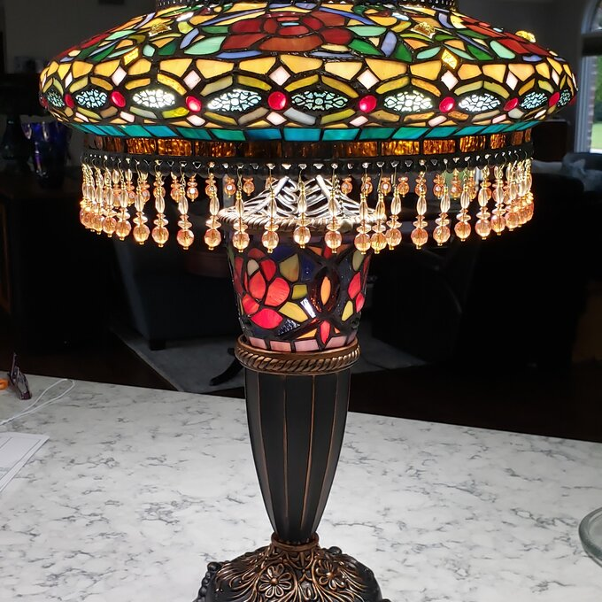
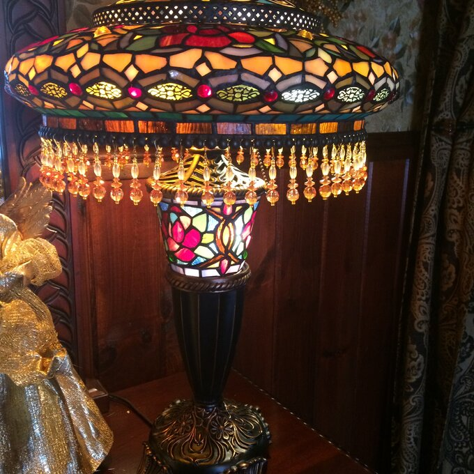
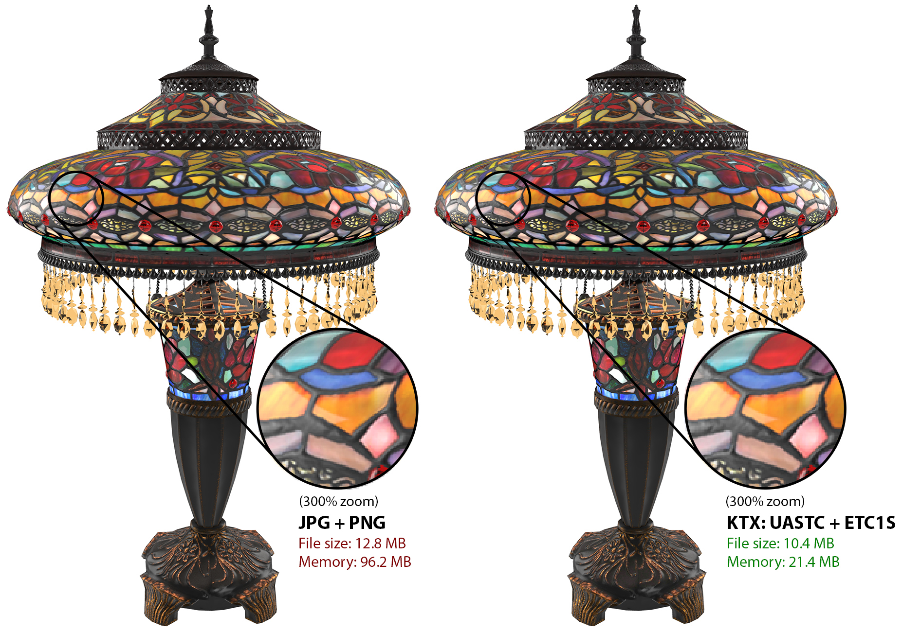

# StainedGlassLamp

## Screenshot


Above: screenshot from the [Babylon.js Sandbox](https://sandbox.babylonjs.com/).

## Description

This model represents a real product, a Tiffany-style stained glass table lamp being sold [on the Wayfair website](https://www.wayfair.com/lighting/pdp/fleur-de-lis-living-credle-275-table-lamp-fdlv3095.html). 

The model is made of eight parts, each with their own materials and using five 2048x2048 PNG textures, seven 1024x1024 PNGs, five 512x512 PNGs, and two 256x256 PNGs. All UVs are arranged between 0 and 1, except for a few overlapping parts which have been offset 1 UV unit to avoid texture baking errors. The model uses 70,588 triangles and 46,828 vertices.

The model demonstrates several extensions: 
* [KHR_materials_clearcoat](https://github.com/KhronosGroup/glTF/blob/master/extensions/2.0/Khronos/KHR_materials_clearcoat/README.md)
* [KHR_materials_ior](https://github.com/KhronosGroup/glTF/pull/1718)
* [KHR_materials_translucency](https://github.com/KhronosGroup/glTF/pull/1825)
* [KHR_materials_transmission](https://github.com/KhronosGroup/glTF/blob/master/extensions/2.0/Khronos/KHR_materials_transmission/README.md)
* [KHR_materials_variants](https://github.com/KhronosGroup/glTF/blob/master/extensions/2.0/Khronos/KHR_materials_variants/README.md)
* [KHR_materials_volume](https://github.com/KhronosGroup/glTF/pull/1726)
* [KHR_texture_basisu](https://github.com/KhronosGroup/glTF/blob/master/extensions/2.0/Khronos/KHR_texture_basisu/)

## Reference Photos

The use of real-world photographic reference is meant to help glTF developers with calibrating material features and renderer behavior, so we can more accurately represent e-commerce products. Additional photo reference is available [on the Wayfair website](https://www.wayfair.com/lighting/pdp/fleur-de-lis-living-credle-275-table-lamp-fdlv3095.html).


Above: Photo of the real product (left) next to a screenshot of the glTF 3D model (right).

Below: More reference photos of the real product.



## KHR_materials_transmission

The models in `\glTF` and `\glTF-Binary` use the extension [KHR_materials_transmission](https://github.com/KhronosGroup/glTF/blob/master/extensions/2.0/Khronos/KHR_materials_transmission/README.md) for the stained glass, the red embedded glass gems, and the amber hanging plastic beads to show colored translucency and specular reflection.

The stained glass material uses roughness to simulate the microfacet scattering of light through the thin surface, effectively blurring the transmitted light. Behind the glass you should be able to see blurry hints of opaque surfaces like the bright lamp bulbs and the dark hardware. 

`KHR_materials_transmission` does not accurately portray the refraction that should occur on the red and amber beads. This extension offers an incremental improvement over alpha-as-coverage for glass-like transparency, by coloring the transmitted light, and allowing accurate specular reflections. These surfaces could be further improved with future extensions [KHR_materials_ior](https://github.com/KhronosGroup/glTF/pull/1718) and [KHR_materials_volume](https://github.com/KhronosGroup/glTF/pull/1726). Transmission works fine for the stained glass because the glass is thin enough and rough enough that refraction would not be that obvious.

The stained glass material uses alpha-as-coverge in alpha-test mode to cut out holes where the red beads are present. This is meant to prevent the stained glass geometry from interfering with the transmission of the red beads.


Above: Animated GIF showing transmission enabled and disabled.

## KHR_materials_clearcoat

The models in `\glTF` and `\glTF-Binary` use the extension [KHR_texture_clearcoat](https://github.com/KhronosGroup/glTF/blob/master/extensions/2.0/Khronos/KHR_materials_clearcoat/README.md) on the multicolored stained glass to add smooth reflections on top of the glass. The glass material must be rough for `KHR_materials_transmission` to create microsurface refractions, so clearcoat restores shiny surface reflections to the smooth outer surfaces of the stained glass.

The two textures for transmissionTexture and clearcoatTexture have been packed together into a single bitmap `FDLV3095_glass_transmission-clearcoat.png` using the red and green channels, to help optimize the asset. 


Above: Animated GIF showing clearcoat enabled and disabled.

## KHR_materials_translucency

The model in the `\glTF-Translucency` folder uses the extension [KHR_materials_translucency](https://github.com/KhronosGroup/glTF/pull/1825) for the stained glass instead of `KHR_materials_transmission`. Translucency emulates the microfacet scattering of the light bulbs shining light through to the outside surface of the stained glass. 

`KHR_materials_transmission` remains on the red embedded glass gems and the amber hanging plastic beads to show colored translucency and specular reflection. `KHR_materials_ior` and `KHR_materials_volume` have been added to these materials to enable refraction. The red glass gems use IOR 1.52 and the amber plastic beads use IOR 1.46.

Three punctual point lights have been added to the model to demonstrate translucency, positioned within the three light bulbs, two in the upper area and one inside the base. The intensities have been adjusted "by eye" in Babylon.js to emulate the reference photos.

The redundant emissive texture has been removed from the stained glass material, because translucency dynamically shows the effect of light being refracted through the surface. Emissive textures remain however for the rest of the surfaces, because rasterized renderers like Babylon.js do not calculate bounce lighting.

Clearcoat is not needed on the stained glass because translucency does not use surface roughness to control scattering. Therefore the roughness texture has been revised from the original to make the glass smooth again.


Above: Animated GIF showing translucency enabled and disabled.

## KHR_materials_variants

The model in the `\glTF-Variants` folder uses the extension [KHR_materials_variants](https://github.com/KhronosGroup/glTF/blob/master/extensions/2.0/Khronos/KHR_materials_variants/README.md) is used to add a variant with all the emissive textures disabled, to simulate the lights being turned off. The default variant has the emissive textures enabled, so the lights appear to be on by default.


Above: Animated GIF showing variants "Lamp on" and "Lamp off".

## KHR_textures_basisu

The model in the `\glTF-KTX` folder uses [Basis Universal](https://github.com/KhronosGroup/KTX-Software) texture compression and the extension [KHR_texture_basisu](https://github.com/KhronosGroup/glTF/blob/master/extensions/2.0/Khronos/KHR_texture_basisu/) to compress from 27.9 MB down to 11.8 MB.

[glTF-Transform](https://gltf-transform.donmccurdy.com/cli.html) was used to compress the original glTF with the commands:

```
gltf-transform etc1s StainedGlassLamp.glb StainedGlassLamp_2.glb --slots "!{clearcoatNormalTexture,normalTexture}" --quality 255
gltf-transform uastc StainedGlassLamp_2.glb StainedGlassLamp_ktx.glb
```



Above: (left) 27.9MB with all PNG textures, (right) 11.8MB with all KTX textures.

## Path Traced Render Examples ##

This model has been tested in a few other non-rasterized renderers, which often require a few adjustments. E.g. emissive textures should be removed from non-emissive parts, allowing path tracing to create more accurate bounce lighting. 


Above: Ray-traced render in Intel [OSPRay Studio](https://github.com/ospray/ospray_studio).

Below: Path-traced render in Dassault Systèmes [Enterprise PBR Sample Renderer](https://github.com/DassaultSystemes-Technology/dspbr-pt).


## Authoring Details ##

The model was created with [Autodesk 3ds Max](https://www.autodesk.com/products/3ds-max/) and exported to glTF via the [Max2Babylon](https://github.com/BabylonJS/Exporters/tree/master/3ds%20Max) exporter. The glTF file was then edited manually in [Visual Studio Code](https://code.visualstudio.com) with the [glTF Tools](https://github.com/AnalyticalGraphicsInc/gltf-vscode) extension to add KHR extensions. 

The textures were created from photo reference, then augmented with procedural textures and hand-painted detail. The emissive textures were pre-rendered in 3ds Max using the V-Ray renderer and sphere lights, and the textures were hand-tuned to look better in Babylon.js. Because the emissives do not represent physically-accurate lighting, they can only simulate diffuse lighting not reflection/refraction, so the pure-metal and plastic-bead materials do not have emissive textures.

The asset passes [glTF Validation](http://github.khronos.org/glTF-Validator/) except the variants model has an UNSUPPORTED_EXTENSION warning and five UNUSED_OBJECT infos for `KHR_materials_variants` which is not yet supported by the validator. The KTX model also has several warnings for `KHR_textures_basisu` which is also not yet supported. The translucency model also has a validation warning for an unsupported `KHR_materials_translucency`.

## License Information

(C) 2020, Wayfair LLC. CC-BY 4.0 International https://creativecommons.org/licenses/by/4.0/. 
